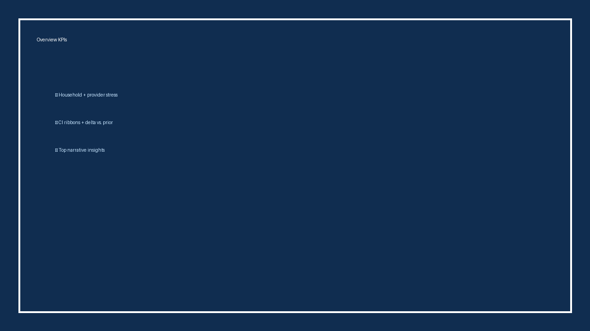
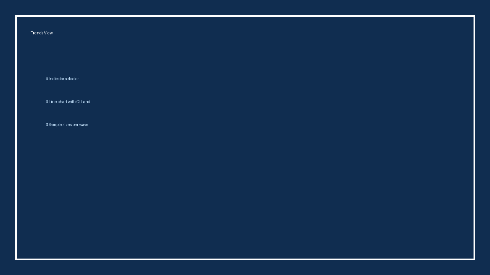
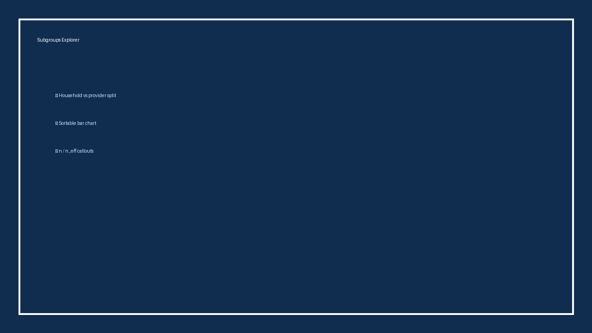
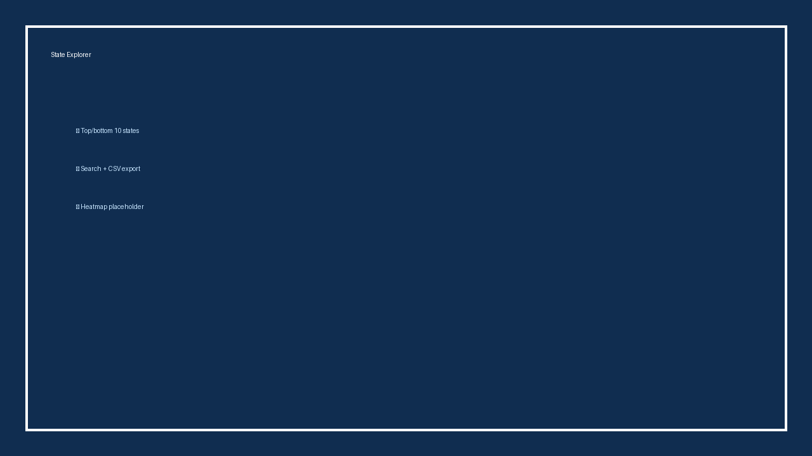

# Childcare Workforce & Household Trends Dashboard

Streamlit-powered analytics surface for RAPID Survey data. The app fuses household well-being, childcare access, and provider workforce stress signals into a single command-center experience tailored to early childhood policy teams such as the Stanford Center on Early Childhood.

## Feature Tour

| Overview KPIs | Trends View |
| --- | --- |
|  |  |

| Subgroups Explorer | State Explorer |
| --- | --- |
|  |  |

- **Overview:** KPI tiles with absolute values, 95% CIs, and deltas vs. the prior wave, plus narrative callouts for leadership briefings.
- **Trends:** Indicator selector driving line charts with CI ribbons and hover cards that expose wave metadata and sample sizes.
- **Subgroups:** Horizontal bar chart that compares household/provider subsegments, sortable by estimate or sample size with n/n_eff badges.
- **State Explorer:** Ranked tables (top/bottom 10 + searchable full list) with instant CSV export and heatmap media hooks.

## Quick Start (Python 3.11)

```powershell
py -3.11 -m venv .venv
.\.venv\Scripts\Activate.ps1
python -m pip install -r requirements.txt
```

### 1. Seed demo-ready data (critical)

```powershell
python scripts/bootstrap_demo_data.py
```

Generates deterministic CSVs under `data/outputs/`:

- `indicators_overall.csv`
- `subgroups_household_latest.csv`
- `subgroups_provider_latest.csv`
- `state_indicator_heatmap_latest.csv`

### 2. Launch the dashboard

```powershell
streamlit run dashboard/app.py
```

You should see all four pages populate immediately. Missing-data warnings now point back to the bootstrap command so new contributors never have to hunt for the legacy Project 1 pipeline.

### 3. Optional verification checklist

```powershell
python -m pytest -q
python -c "from dashboard.utils.load_data import load_all_data; b = load_all_data(use_cache=False); print('indicators', b.indicators_overall.shape)"
```

- The test suite exercises the data layer against the synthetic bundle.
- The loader smoke test confirms every frame is assembled before you commit.

## Data Workflow & Automation

- `scripts/bootstrap_demo_data.py` replaces the old `src/run_pipeline.py` dependency with deterministic synthetic exports.
- `scripts/generate_readme_screenshots.py` produces the README thumbnails (uses Pillow; no manual design tools required).
- `scripts/export_dashboard_demo.py` still emits the lightweight factsheet + narrative brief in `docs/demo_dashboard/` for stakeholder packets.
- Streamlit surfaces cached loaders from `dashboard/utils/load_data.py`, which now exposes `DATA_BOOTSTRAP_COMMAND` so every warning/toast references the correct remediation step.

## Why This Project Fits the Stanford Data Analyst 1 Role

This repo demonstrates the exact analytics muscle listed in requisition **108035** for the Stanford Center on Early Childhood:

- **Rapid-cycle analysis:** deterministic bootstrapper plus Trend/Subgroup views showcase how to spin up monthly survey releases without waiting for an upstream ETL job.
- **Data validation:** pytest coverage, CSV schema enforcement, and cached loaders mirror the "validate data to ensure high quality product" core duty.
- **Visualization & reporting:** Plotly + Streamlit pages translate complex RAPID indicators into shareable figures, fact sheets, and downloadable tables.
- **Collaboration-ready tooling:** Python 3.11 lockstep with CI, scripted screenshot generation, and documented commands make it easy for remote teammates to reproduce results—aligned with the role’s remote arrangement and multi-stakeholder context.
- **Survey domain expertise:** Household vs. provider splits, subgroup comparisons, and state rankings reflect the RAPID project’s emphasis on actionable early childhood policy insights.

## Additional Docs & Assets

- Factsheet: [docs/demo_dashboard/factsheet_latest.html](docs/demo_dashboard/factsheet_latest.html)
- Narrative brief: [docs/demo_dashboard/brief_latest.md](docs/demo_dashboard/brief_latest.md)
- Screenshot + figure sources: [docs/demo_dashboard/screenshots](docs/demo_dashboard/screenshots)

Regenerate the entire media bundle for a portfolio drop with:

```powershell
python scripts/generate_readme_screenshots.py
python scripts/export_dashboard_demo.py
```

Share the Streamlit URL or the static artifacts above in your resume/cover-letter packet to highlight applied RAPID Survey analytics.
